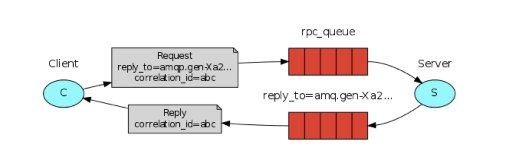

## RPC(Remote Procedure Call)

RPC作为一个普遍的模式，依然存在着许多有待处理的问题：
    在程序不知道其调用的函数是本地还是远程调用时，RPC系统将出现更多的问题。如，导致从未知的系统中获取的结果，为代码的调试增加不必要的复杂性。因此，如果错误的使用RPC模式，将导致不可维护的系统，及控制结构复杂、混乱且难理解的的代码。

因此，为了解决上面的问题，需要实现一下几点：
    * 弄清楚哪些函数时本地调用，哪些函数时远程调用；
    * 将系统文件化记录。
    * 明确各组件之间的以来关系。
    * 做好错误处理。
    * 当RPC服务器长时间宕机时，做好措施。如使用异步管道，使结果异步到下一个计算阶段，而不是想RPC那样阻塞。

### Callback queue
在RabbitMQ中进行RPC操作时比较普遍的。一个客户端发送请求message，然后一个server以一个response message来回复该消息。而客户端为了收到该response，需要在发送时家一个 callback queue，从而达到处理该request message 的目的。
    q, err := ch.QUeueDeclare(
        "",             // name,
        false,          // durable,
        false,          // delete when usused
        true,           // exclusive
        false,          // no-wait
        nil,            // arguments
    )
    err = ch.Publish(
        "",             // exchange
        "rpc_queue",    // routing key
        false,          // mandatory
        false,          // immediate
        amqp.Publishing {
            ContentType: "text/plain",
            CorrelationId: corrId,
            ReplyTo: `q.Name`,
            Body:[]byte(strconv.Itoa(n)),
        })

    amqp.Publishing的属性有14个，其中最为常用的为：
        persistent：标记一个消息时持久（persistent）的（true），还是暂时的（transient）的（false）。
        content_type：用来描述编码的文件类型。如，如果消息时json格式，则其值为：application/json。
        reply_to：其表示callback queue的名称。
        correlation_id：用来关联其指定的requests 的RPC response。

### Correlation Id
如果为每一个RPC request都创建一个callback queue，会降低效率。二最好的方法就是为每一个客户端创建一个callback queue。而这种方式会给人带来疑惑，callback queue收到的response属于哪一个request？ 因此就引入了correlation_id，这一属性。

在每一个request，都将为其设置一个独一无二的值作为correlation_id。然后，在收到callback queue中收到一个消息时，可以通过查看该属性来匹配response和request。如果发现一个correlation_id，其和我们锁发送的requests不匹配，就可以将其丢弃，因为在server端可能存在竞争条件，当server想客户端发送一个response后，在还未接收到客户端发送的ACK，server就宕机了，那么在从新启动该RPC server时，其会对该request进行再次处理。因此，在客户端必须对重复的response进行处理，二RPC同样如此。

### Summary
RPC的工作如下图所示：

当启动一个客户端时，会同时创建一个独立的callback queue。对于每个RPC请求，客户端都将发送callback queue 和 标志request 的 correlation_id，并将该request发送到rpc_queue 队列中。

当请求发送到 rpc_queue，服务器段将对其进行处理，并将结果通过 rply_toziduan 字段指向的队列返回给客户端。

客户端将等待callback queue，当有消息出现在队列中，将首先检查correlation_id属性，如果与request匹配，则将其返回给应用。

### 
