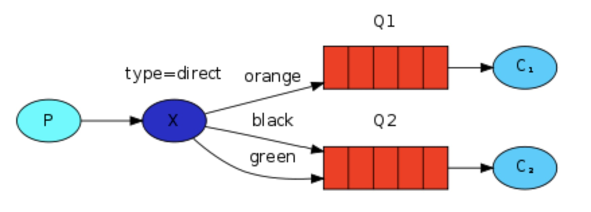
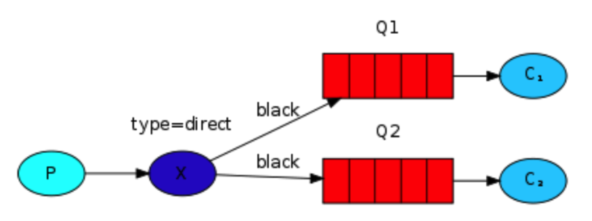

# Routing
将队列和 exchange绑定起来，就可以让该队列收到从该exchange发出的消息，实现消息订阅的模式。。

在绑定时，可以利用 routing_key参数，可以实现队列接收exchange的部分消息，使用方式如下：

	err = ch.QueueBind(
		q.Name, 			// queue name
		"black",			// routing key
		"logs",			// exchange
		false,
		nil
	)
上面的方式，绑定key 依赖于exchange type。如果exchange type 是 fanout，则就会忽略该key值。

## 1、Direct Exchange
fanout 类型的exchange，只能盲目地向各个队列广播消息，不具备灵活性。而direct exchange就可弥补其不足。direct 类型的exchange可以将消息根据队列的 binding key 和message的 routing key的匹配结果来进行消息分发。具体如下图所示：

从上面可以看出，有两个队列绑定到了direct exchange上，第一个队列的绑定key 是orange，第二个队列有两个绑定的key，分别是 black和 green。因此，如果routing key是orange的消息将被转发到Q1，如果routing key是 black或 green，则将被转发到Q2.而其他的消息，则将被丢掉，不予转发。
## 2、Multiple bindings
在 RabbitMQ原理中，可以存在多个队列使用同一个binding key的情况。如下图所示，可以在 x 与队列 Q1和Q2都使用 black 作为binding key。此时，direct 类型的 exchange就的效果和fanout是相同的，都是向队列进行广播消息。

	
	