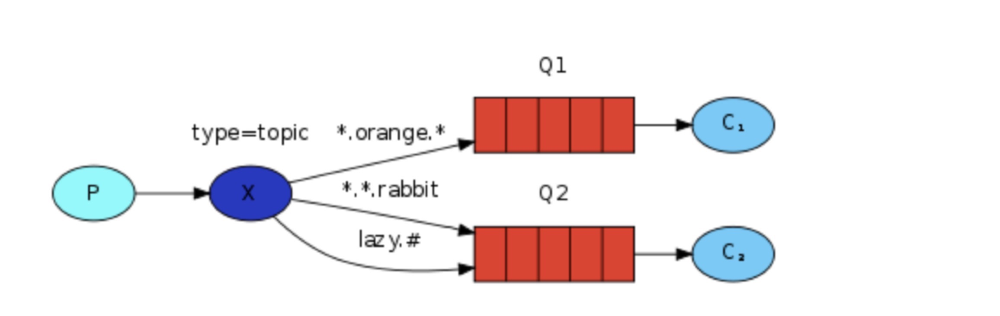

## Topics

前面（Routing）使用direct类型的exchange，虽然可以有效地实现日志系统，但它不能基于多个标准进行路由。如，可以设计一个根据日志的严重性（info/warn/crit...) 和功能（auth/cron/kern) 来进行日志分发。这样的系统使用起来才更灵活且方便。因此就引出了 topic 类型的 exchange。

## Topic exchange
Topic 类型的exhcnage 接收的 routing_key类型的名称必须是一个由点作为分隔的字符串（如，"zhang.wei.test"，这里可以定义一些与消息相关的任意词)，并且小于255 bytes，使用该routing_key可以将一个 queue 绑定到一个exchange上。

binding key 必须Topic 类型的exchange 的实现逻辑与 direct 类型的类似，一个指定了routing key 的消息将被发送到所有绑定了匹配的binding key的队列中，但关于routing_key的绑定有下面两种特殊的形式：
    * *(star) 可以代替一个单词。
    * #(hash) 可以指定一个或多个单词.
  

如图所示，routing_key 为三个用于描述动物的词，第一个词用于描述速度，第二个表示颜色，第三个表示种类。可以看出，exchange 的类型为 topic， 与其绑定的Q1的routing key为 *.orange.\*,Q2的routing key 为 \*.\*.rabbit和 lazy.#,	即表示，Q1接收所有颜色为orange的message，Q2接收所有种类为rabbit，和速度lazy的message。因此，如果一个message的routing key为 quick.orange.rabbit，Q1和Q2都会接收该消息。如果收到routing key为 quick.orange.fox，则exchange将会被发送到Q1，lazy.brown.fox的message则会被发送到Q2。

如果一个消息的routing key为 orange 或 quick.orange.male.rabbit，则这两个消息将被丢弃。但如果一个消息的routing key为 lazy.orange.male.rabbit,则它会被发送到Q2队列（#）。

Topic类型的exchange的功能很强大，可以通过routing key 特殊符号的使用，使其表示的像其他的类型的exhchange一样。如果一个队列使用 # 作为routing key，他将忽略routing key而接收所有消息，想 fanout 类型的exchange一样。 当绑定中没有使用 * 或 # 时，Topic类型的exchange就和direct类型的exchange的功能相同。

